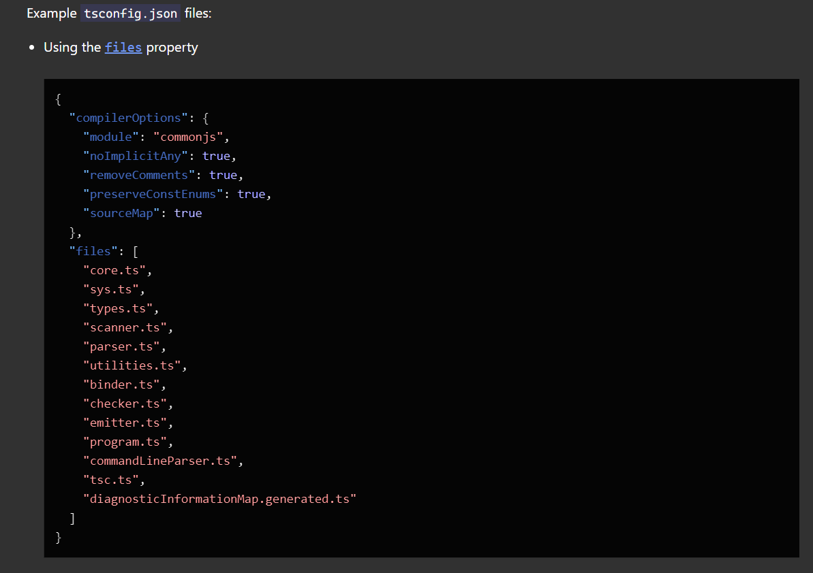
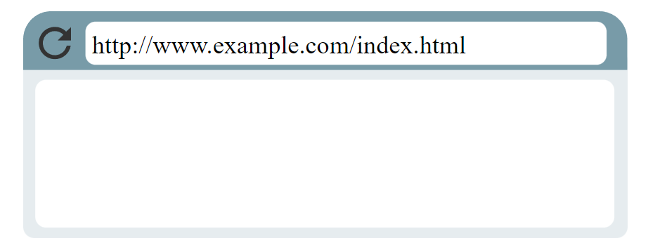
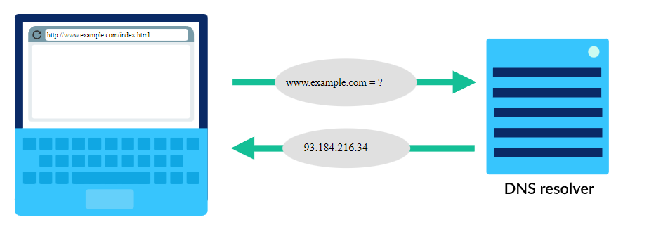
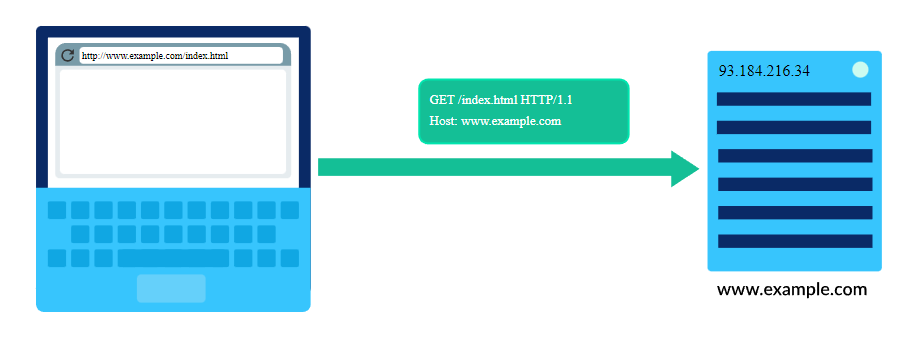
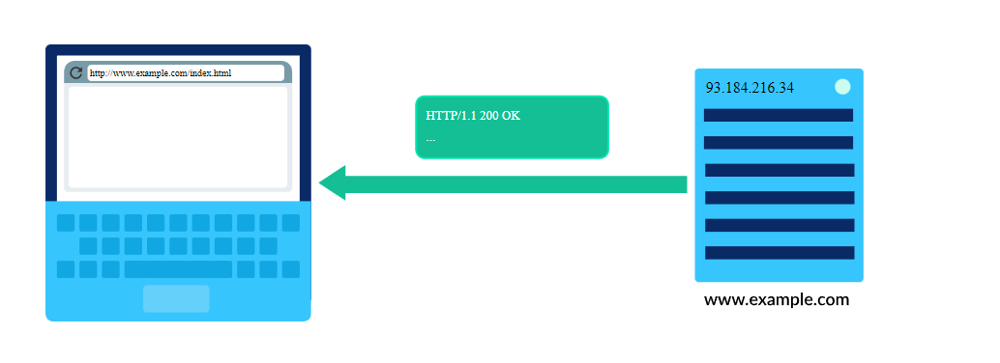
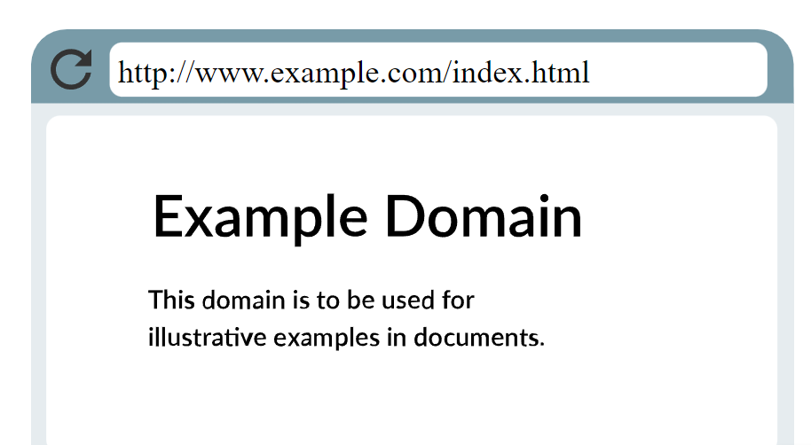

# Express and Node.js Basic Level Quiz

## Theory

---

## 1.What is NodeJS?

- Node.js is a server-side platform built on Google Chrome's JavaScript Engine (V8 Engine)
- Node.js is an open source server environment
- Node.js is free
- Node.js runs on various platforms (Windows, Linux, Unix, Mac OS X, etc.)
- Node.js uses JavaScript on the server
- As an asynchronous event-driven JavaScript runtime, Node.js is designed to build scalable network applications

`Node.js = Runtime Environment + JavaScript Library`

## 2.What is V8 Engine?

- V8 is the name of the JavaScript engine that powers Google Chrome. It's the thing that takes our JavaScript and executes it while browsing with Chrome.
- V8 is the JavaScript engine i.e. it parses and executes JavaScript code. The DOM, and the other Web Platform APIs (they all makeup runtime environment) are provided by the browser.
- The cool thing is that the JavaScript engine is independent of the browser in which it's hosted. This key feature enabled the rise of Node.js. V8 was chosen to be the engine that powered Node.js back in 2009, and as the popularity of Node.js exploded, V8 became the engine that now powers an incredible amount of server-side code written in JavaScript.

## 3.What is Event Loop in NodeJS

- An event loop is an event-listener which functions inside the NodeJS environment and is always ready to listen, process, and output for an event.

- An event can be anything from a mouse click to a keypress or a timeout.

## 4. What is the use of tsconfig.json file?

The presence of a tsconfig.json file in a directory indicates that the directory is the root of a TypeScript project. The tsconfig.json file specifies the root files and the compiler options required to compile the project.



## 5. What are the methods provided by `fs` module to manipulate files?

Common use for the File System module:

- Read files:The fs.readFile() method is used to read files on your computer.

```html
<html>
  <body>
    <h1>My Header</h1>
    <p>My paragraph.</p>
  </body>
</html>
```

```javascript
var http = require("http");
var fs = require("fs");

http
  .createServer(function (req, res) {
    fs.readFile("demofile1.html", function (err, data) {
      res.writeHead(200, { "Content-Type": "text/html" });
      res.write(data);
      return res.end();
    });
  })
  .listen(8080);
```

> in the above stated code we get that at the end the html wilfe will be read and rendered inthe browser by the server

- Create files:
  The File System module has methods for creating new files:

  - fs.appendFile()
  - fs.open()
  - fs.writeFile()

The fs.appendFile() method appends specified content to a file. If the file does not exist, the file will be created:

```javascript
var fs = require("fs");

fs.appendFile("mynewfile1.txt", "Hello content!", function (err) {
  if (err) throw err;
  console.log("Saved!");
});
```

The fs.open() method takes a "flag" as the second argument, if the flag is "w" for "writing", the specified file is opened for writing. If the file does not exist, an empty file is created:

```javascript
var fs = require("fs");

fs.open("mynewfile2.txt", "w", function (err, file) {
  if (err) throw err;
  console.log("Saved!");
});
```

The fs.writeFile() method replaces the specified file and content if it exists. If the file does not exist, a new file, containing the specified content, will be created:

```javascript
var fs = require("fs");

fs.writeFile("mynewfile3.txt", "Hello content!", function (err) {
  if (err) throw err;
  console.log("Saved!");
});
```

- Update files :The File System module has methods for updating files:

- fs.appendFile()
- fs.writeFile()

The fs.appendFile() method appends the specified content at the end of the specified file:

```javascript
var fs = require("fs");

fs.appendFile("mynewfile1.txt", " This is my text.", function (err) {
  if (err) throw err;
  console.log("Updated!");
});
```

The fs.writeFile() method replaces the specified file and content:

```javascript
var fs = require("fs");

fs.writeFile("mynewfile3.txt", "This is my text", function (err) {
  if (err) throw err;
  console.log("Replaced!");
});
```

- Delete files: To delete a file with the File System module, use the fs.unlink() method.

The fs.unlink() method deletes the specified file:

```javascript
var fs = require("fs");

fs.unlink("mynewfile2.txt", function (err) {
  if (err) throw err;
  console.log("File deleted!");
});
```

- Rename files:To rename a file with the File System module, use the fs.rename() method.

The fs.rename() method renames the specified file:

```javascript
var fs = require("fs");

fs.rename("mynewfile1.txt", "myrenamedfile.txt", function (err) {
  if (err) throw err;
  console.log("File Renamed!");
});
```

## 6. what is an API ?

APIs are mechanisms that enable two software components to communicate with each other using a set of definitions and protocols. For example, the weather bureau’s software system contains daily weather data. The weather app on your phone “talks” to this system via APIs and shows you daily weather updates on your phone.

API stands for Application Programming Interface. In the context of APIs, the word Application refers to any software with a distinct function. Interface can be thought of as a contract of service between two applications. This contract defines how the two communicate with each other using requests and responses. Their API documentation contains information on how developers are to structure those requests and responses.

## 7. What is JSON format?

- JSON stands for JavaScript Object Notation.

- The format was specified by Douglas Crockford.

- It was designed for human-readable data interchange.

- It has been extended from the JavaScript scripting language.

- The filename extension is .json.

- JSON Internet Media type is application/json.

- The Uniform Type Identifier is public.json.

## 8.Why we use JSON format for API?

JSON was a much more natural fit for developers to exchange structured data. It did not require the rather inconvenient “data binding” and “data serialization” steps that were notoriously difficult when using XML-based APIs.

Instead, JSON allowed APIs to represent structured data in a way that simply was a better fit for the conceptual universe that most developers live in.

## 9. What is a Framework?

- A framework is a portion of code. It provides you with a terrific swift way to create applications as it carries lots of tested functionality.
- In the case of a framework, it calls you, which means the code will never be called into a framework.
- The framework delivers a particular manner to create and deploy software applications.
- Example of Software Framework: AngularJS is one of the JavaScript’s frameworks often used for web applications.

## 10. How an HTTP Communication works.

#### Step 1: Direct browser to URL

When we want to browse the web, we can use many types of computers (like laptops, desktops, and phones), as long as the computer has a browser application installed.
The user either types a Uniform Resource Locator (URL) in the browser or follows a link from an already opened page:

Notice something about that URL: it starts with "http". That's a signal to the browser that it needs to use HTTP to fetch the document for that URL.

#### Step 2: Browser looks up IP

We typically type nice human-friendly URLs into browsers, like "khanacademy.org" and "wikipedia.org". Those domain names map to IP addresses, the true location of the domain's computers. That's handled by the Domain Name System.
The browser uses a DNS resolver to map the domain to an IP address:


#### Step 3: Browser sends HTTP request

Once the browser identifies the IP address of the computer hosting the requested URL, it sends an HTTP request.


An HTTP request can be as short as two lines of text:
`GET /index.html HTTP/1.1`
`Host: www.example.com`

- The first word is the HTTP verb: "GET". There are other verbs for other actions on the web, like submitting form data ("POST").
- The next part specifies the path: "/index.html". The host computer stores the content of the entire website, so the browser needs to be specific about which page to load.
- The final part of the first line specifies the protocol and the version of the protocol: "HTTP/1.1".
- The second line specifies the domain of the requested URL. That's helpful in case a host computer stores the content for multiple websites.

#### Step 4: Host sends back HTTP response

Once the host computer receives the HTTP request, it sends back a response with both the content and metadata about it.

The HTTP response starts similarly to the request:
`HTTP/1.1 200 OK`

- The response begins with the protocol and version, "HTTP/1.1".
- The next number is the very important HTTP status code, and in this case, it's 200. That code represents a successful retrieval of the document ("OK").
  If the server failed to retrieve the document, the status codes provide more information, like if the failure was due to user error or server error. For example, the most well known status code is 404 ("File not found"). That happens whenever you visit a path on a server that doesn't correspond to any document.
  The next part of an HTTP response are the headers. They give the browser additional details and help the browser to render the content.
  These two headers are common to most requests:

`Content-Type: text/html; charset=UTF-8`
`Content-Length: 208`

- The content-type tells the browser what type of document it's sending back.
- The content-length gives the length of the document in bytes, which helps the browser know how long a file will take to download.

#### Step 5: The browser renders the response

The browser now has all the information it needs to render the document requested.


## 11. What is Middleware in ExpressJS

Middleware functions have access to the request object and the response object and also the next function in the application request-response lifecycle.

Middlewares are used for:

- Change the request or response object.
- Execute any program or code
- End the request-response lifecycle
- Call the next middleware.

> Middleware Syntax:

The basic syntax for the middleware functions are as follows –

app.get(path, (req, res, next) => {}, (req, res) => {})
